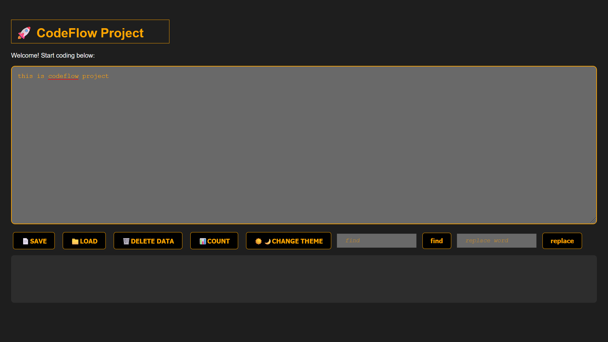
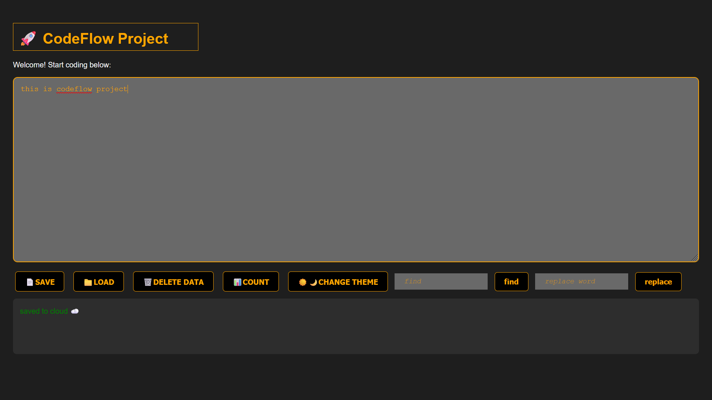
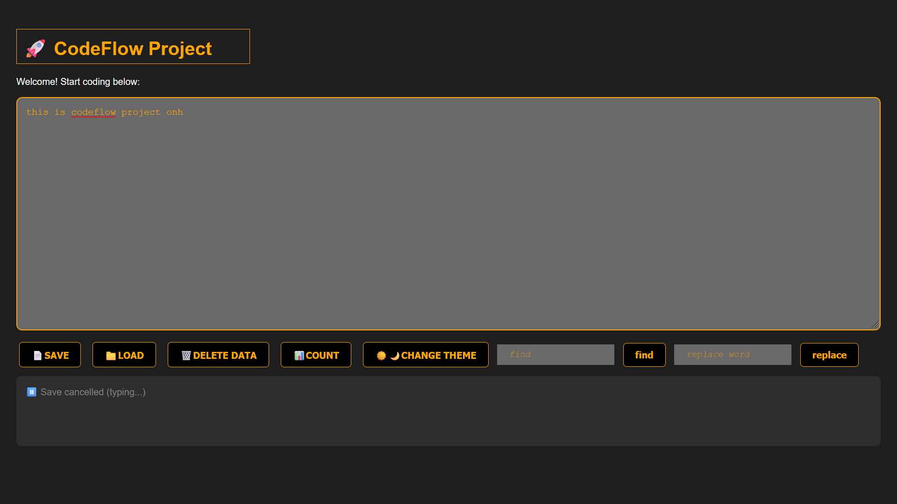
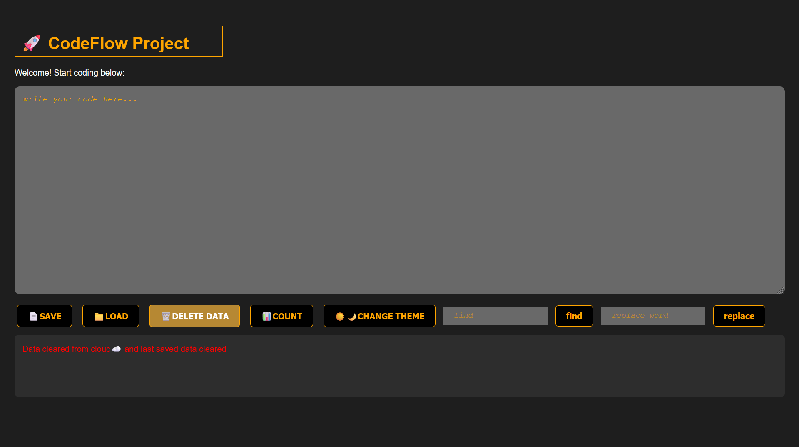
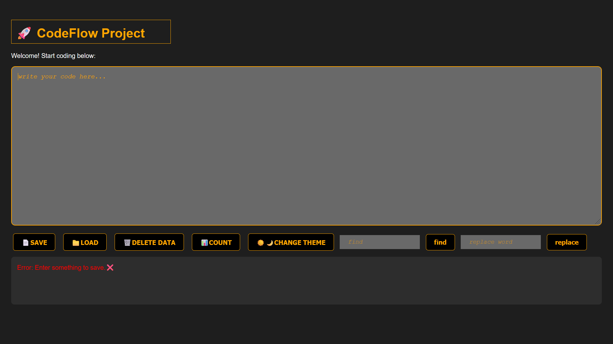
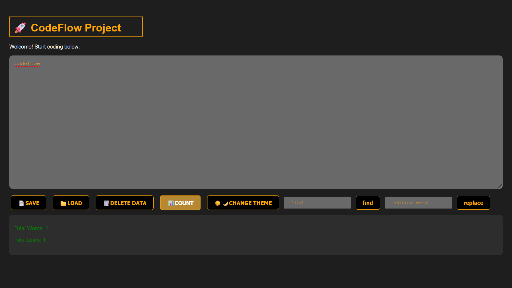
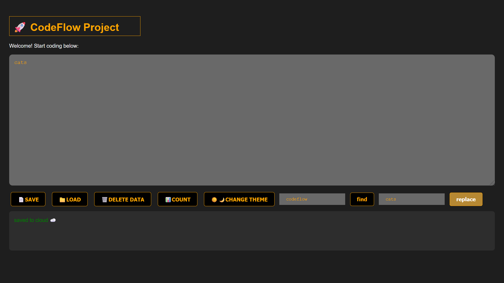
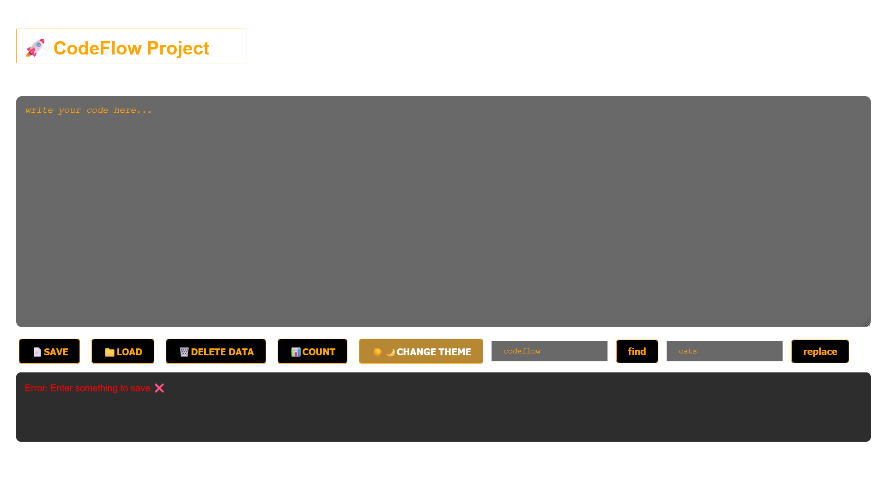

# Codeflow  [Last updated: 3rd Jan,2026]
Learning full-stack dev by building CodeFlow - a collaborative code editor

# 🚀 CodeFlow - Learning Journey

Building a collaborative code editor from scratch to master full-stack development.

## 📅 Progress

### Week 1: Foundations
- **#**: JavaScript fundamentals + Basic editor
  - Built code editor with save/load
  - Added find & replace functionality
  - Implemented keyboard shortcuts (Shift+S to save)
  - Added theme toggle (dark/light mode)
  - Built 3 side projects: todo list, rock-paper-scissors, visual autoplay

- **#**: Async JavaScript mastery
  - Learned: Promises, async/await, event loop
  - Implemented: AbortController for request cancellation
  - Implemented: Debounce pattern for autosave
  - Built: Traffic light simulator, data loader, cloud saver

### Week 2: React + Modern Editor (Coming Soon)

## 🛠️ Tech Stack (So Far)
- HTML5 / CSS3
- JavaScript (ES6+)
- localStorage for persistence
- Async patterns (Promises, AbortController, Debounce)

## 📸 Screenshots

### 1 - Codeflow Editor

### 2 - Async Autosaving

### 3 - Async Autosave

### 4 - AbortController Cancel Save

### 5 - Delete Data from Local Storage and Data for Undo Operation

### 6 - Empty Input box Error

### 7 - Count Total Lines and Words

### 8 - Find Total Occurences

### 9 - Replace Word entered in Find box

### 10 - Light Theme

## 💡 What I Learned

### 1
- DOM manipulation and event handling
- localStorage for data persistence
- String methods for text processing
- Keyboard event handling

### 2
- Event loop and async execution model
- Promise creation and chaining
- async/await for cleaner async code
- AbortController for cancelling operations
- Debounce pattern to prevent excessive API calls
- Race condition prevention

## 🔗 Links
- [Live Demo](https://your-demo-link.com) (coming soon)
- [GitHub Repo](https://github.com/Kushagrakaneki/Codeflow)

## Acknowledgments
Learning by building. No tutorial hell. Just shipping code .

---
